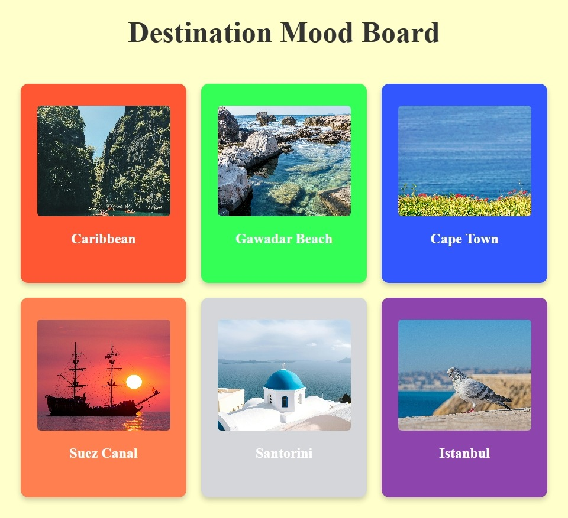

# 🖼️ Destination Mood Board

An interactive **React + TypeScript** app built with **Vite** that allows users to create a mood board of travel destinations.  
This project demonstrates **component-based design**, **state management with hooks**, and modern frontend tooling.

---

## 🚀 Live Demo

[View Project](https://hianshu-kumar-2301.github.io/fcc-destination-mood-board/)

---

## 🛠️ Tech Stack

- **React 18** - UI components
- **TypeScript** - type safety
- **Vite** - build tool & dev server
- **ESLint** - linting & code quality

---

## 📸 Screenshots



---

## 📚 Features

- Add destinations as mood board items.
- Visual layout of selected destinations.
- Modular React components (`Moodboard`, `MoodboardItem`).
- Fast development and optimized builds with **Vite**.
- Type safety and maintainability with **TypeScript**.

## 📂 Project Structure

```code
root/
|--public/
|--src/
|  |--App.tsx
|  |--styles.css
|  |--main.tsx
|  |--components/
|  |  |--MoodBoard.tsx
|  |  └──MoodBoardItem.tsx
|  └──assets/
|     └──screenshot.jpeg
|--index.html
|--package.json
|--vite.config.ts
|--tsconfig.json
|--README.md
```

---

🧑‍💻 How to Run Locally

1. Clone the repo:

    ```bash
    git clone https://github.com/himanshu-kumar-2301/fcc-destination-mood-board.git
    ```

2. Navigate into the folder:

    ```bash
    cd fcc-destination-mood-board
    ```

3. Install dependencies

    ```bash
    npm install
    ```

4. Start the dev server

    ```bash
    npm run dev
    ```

---

## 🎯 Learning Highlights

- Practiced React component composition (Moodboard, MoodboardItem).
- Used TypeScript for type safety and cleaner code.
- Configured Vite for fast builds and HMR.
- Applied ESLint rules for consistent coding standards.

## 📌 Future Improvements

- Add drag-and-drop functionality for rearranging destinations.
- Save mood board state to local storage.
- Add image uploads or API integration for destination photos.
- Implement dark/light theme toggle.
